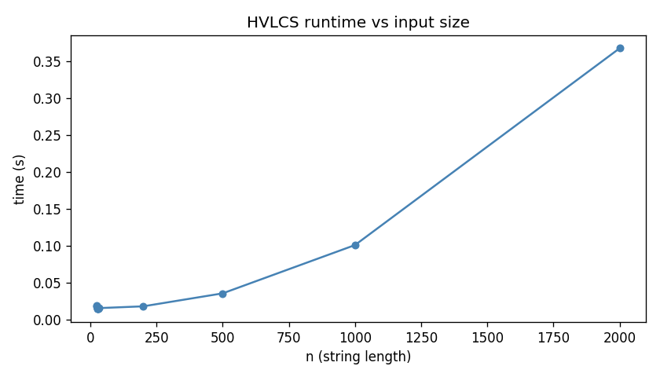

# HVLCS - Highest Value Longest Common Subsequence

**Tyler Pencinger** - UFID: 86826331

**Dominick Dupuy** - UFID: 39922039

---

## Problem Statement

given two strings A and B over some alphabet where each character has a nonneg integer value, find a common subsequence of A and B that maximizes total value. output the max value and the actual subsequence.

if C = c1c2...ck is the chosen subsequence, its value is the sum of v(ci) for each character.

---

## Running the code

requires python 3, no extra libraries needed

```bash
python src/hvlcs.py < data/example.in
```

should print:

```
9
cb
```

input format:

```
K
x1 v1
x2 v2
...
A
B
```

K is alphabet size, then K lines of char + value, then string A, then string B

---

## Files

- `data/example.in` / `data/example.out` - the example from the assignment spec
- `data/test_01.in` through `data/test_14.in` - test inputs for Q1
- `src/hvlcs.py` - main algorithm

---

## Assumptions

- every character in A and B is in the alphabet definition
- values are nonneg integers
- ties during backtracking go to skipping from A first, subsequence might differ but value is always optimal

---

## Q1 - Empirical Comparison

```bash
python tests/benchmark.py
```

| file | n | time (s) |
|---|---|---|
| test_01.in | 25 | 0.0185 |
| test_02.in | 26 | 0.0158 |
| test_03.in | 29 | 0.0165 |
| test_04.in | 25 | 0.0176 |
| test_05.in | 32 | 0.0164 |
| test_06.in | 26 | 0.0154 |
| test_07.in | 30 | 0.0168 |
| test_08.in | 28 | 0.0163 |
| test_09.in | 31 | 0.0159 |
| test_10.in | 30 | 0.0157 |
| test_11.in | 200 | 0.0199 |
| test_12.in | 500 | 0.0370 |
| test_13.in | 1000 | 0.1064 |
| test_14.in | 2000 | 0.3761 |

The first 10 files (n = 25–32) are flat around 0.016s due to Python startup overhead. The growth becomes visible at n = 200 and is clearly quadratic by n = 2000, consistent with the O(mn) runtime of the algorithm.



To regenerate the graph:

```bash
python tests/plot_benchmark.py
```

---

## Q2 - Recurrence

let dp[i][j] = the max value of any common subsequence of A[1..i] and B[1..j]

base cases:

```
dp[0][j] = 0  for all j
dp[i][0] = 0  for all i
```

if either string is empty theres nothing to match so the value is 0.

recurrence:

```
dp[i][j] = dp[i-1][j-1] + v(A[i])        if A[i] == B[j]
dp[i][j] = max(dp[i-1][j], dp[i][j-1])   otherwise
```

why it works: at each cell (i,j) you're asking "what's the best I can do using A up to index i and B up to index j." if the two characters match, you can take it - and since values are nonneg you always should, so dp[i-1][j-1] + v(A[i]). if they dont match, one of them isnt in the optimal solution, so you just take whichever of dp[i-1][j] or dp[i][j-1] is bigger. those are the only two cases so the recurrence covers everything.

---

## Q3 - Pseudocode + Runtime

```
HVLCS(A, B, v):
  m = |A|, n = |B|

  for i = 0 to m:
    for j = 0 to n:
      dp[i][j] = 0

  for i = 1 to m:
    for j = 1 to n:
      if A[i] == B[j]:
        dp[i][j] = dp[i-1][j-1] + v(A[i])
      else:
        dp[i][j] = max(dp[i-1][j], dp[i][j-1])

  result = []
  i = m, j = n
  while i > 0 and j > 0:
    if A[i] == B[j]:
      prepend A[i] to result
      i--, j--
    else if dp[i-1][j] >= dp[i][j-1]:
      i--
    else:
      j--

  return dp[m][n], result
```

runtime is O(mn). the table has m\*n cells and each one is constant time, so thats O(mn). backtracking walks at most m+n steps which gets absorbed. space is also O(mn) since you need the whole table to backtrack - you could drop it to O(n) if you only wanted the value, but then you cant reconstruct the actual subsequence.
